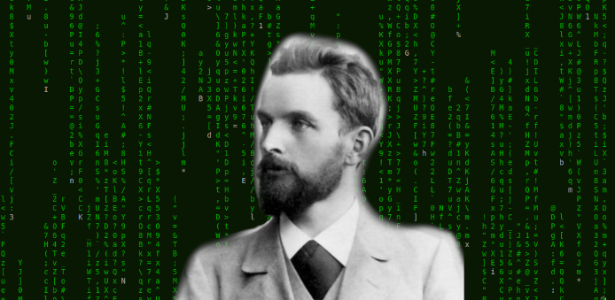

# Friegeld_USDC

A wrapped USDC token which implements demurrage as conceptualized by economist Silvio Gessel.

Demurrage fees were a cost or tax imposed on currencies during the early 20th century to disincentivize hoarding of money
and incentivize spending. The way it worked was currency was only valid if it was stamped, and once it was stamped it 
would lose some percentage of its value, e.g. 1%. This is different to inflation, where new currency is circulated
thus diluting the value. Inflation can result in imprecise reduction in purchasing power, whereas demurrage reduces 
purchasing power through fixed regular fees. 

Prosperity certificates were a system introduced in Alberta during the Great Depression to incentivize spending. 
Hoarding of certificates was disincentivized by the holder requiring to affix a stamp to their certificate in
order to maintain their validity. However, since they were physical notes, there was an inconvenience in having 
to affix stamps constantly, the stamps often fell off, and the certificates were not often accepted as tender.
For these reasons, while initially successful in increasing the velocity of the money, they became unpopular
and the program was cancelled after a year.

John Maynard Keynes argued against the use of demurrage fees as it could easily be avoided by utilizing competing
currencies, therefore inflation would be a preferred alternative. However, on blockchains, we have the ability 
to program in the rules and make them impossible to side-step. Since we are using a digital currency, we can also 
avoid the issues of physical notes.

Initially, the contract was going to be designed to collect a demurrage fee from all holders of the token. However,
doing this in one transaction would be impractical as we would have to store a list of all token holders which is 
not done by default with ERC20. On top of this, the gas fee to do so would be enormous.

Instead, we have opted for an alternate solution. A struct of addresses and block numbers will be maintained,
and a mapping will be used to link addresses to the block numbers. A demurrage fee will be permitted to be 
claimed by anyone, so long as a specified number of blocks has elapsed since the address was last charged.
In order to ensure the demurrage fee is actually implemented, a small incentive will be provided to the
caller of the function, in tokens, to cover for any potential gas fees. When the function is called,
the caller will recieve their incentive from the address's balance, and another portion will be transferred
to a tax address which will collect the demurrage fees.
